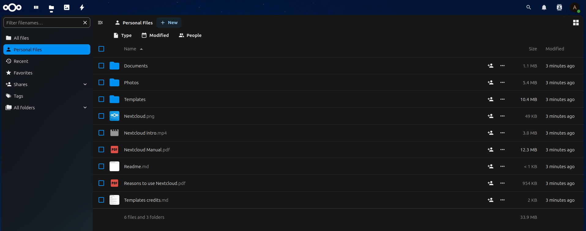
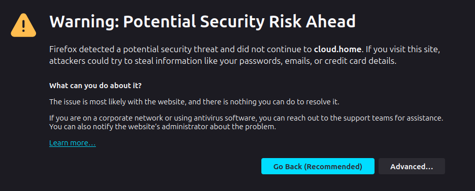

Start Your Own Cloud in Minutes



## What is Nextcloud?

Nextcloud is a self-hosted productivity platform that offers secure file sharing, collaboration, and cloud storage. It empowers users to retain control over their data while providing features comparable to popular cloud services. Nextcloud’s flexibility can be expanded with popular add-ons such as:

- **Calendar** for scheduling
- **Contacts** for managing personal and shared contacts
- **Deck** for project management
- **OnlyOffice/Collabora Online** for real-time document editing
- **Talk** for secure video calls and chat

You can check out the [Nextcloud App Store](https://apps.nextcloud.com) for all extention apps.

With its rich ecosystem, Nextcloud is ideal for both personal use and enterprise-level deployment.

## How It Works

The platform uses the following components:

- **Nextcloud and Cron**: Core functionality and background tasks
- **PostgreSQL**: Database for administrative data storage.
- **Redis**: Caching backend.
- **Nginx-proxy**: Automated Nginx reverse proxy.
- **Omgwtfssl**: Self-signed SSL certificate generator.
- **Letsencrypt-companion** - Automated creation, renewal and use of SSL Let's Encrypt certificates.

> [!NOTE]
> You can use either Omgwtfssl (for self-signed local HTTPS) or Letsencrypt-companion (for Let's Encrypt secured HTTPS). The latter requires a configured domain.

## Bringing Code onto Your Host

1. Ensure you have Git or another tool to clone repositories. [Download Git here](https://git-scm.com/downloads).
2. Clone the `nextcloud` code to your host:
   - Prepare a directory for the code.
   - Open a terminal in this directory.
   - Run the clone command:
     ```bash
     git clone https://github.com/androg9n/nextcloud.git
     ```
   - Navigate into the directory with the cloned code:
     ```bash
     cd nextcloud
     ```
## Configuration (Optional)

The default configuration is workable and assumes local use with a self-signed certificate for local `cloud.home` domain.

> [!NOTE]
> The only you have to configure for succesfull starting is domain resolving from all host you want to have access Nextcloud server.
> It can be solved by Domain name hosting provider config, local DNS config, or even by editing `/etc/hosts` (for local solution).

Feel free to open variables file `docker-compose/.env` with your favorite text editor. Here you can configure:
- **Nextcloud image version**
- **PostgreSQL image version**
- **Domain hostname**

For switch between Self-signed and Let's Encrypt SSL/TLS enable only one service Omgwtfssl or Letsencrypt-companion in `docker-compose/compose.yaml` file.

## Prerquisites

1. Ensure Docker Compose is installed on your host. [Installation instructions](https://docs.docker.com/compose/install/).

## Starting

1. Open a terminal in the `nextcloud` code directory.
2. Navigate to the `docker-compose` directory:
   ```bash
   cd docker-compose 
   ```
3. Start the services with the command: `docker compose up -d`.
   ```bash
   docker compose up -d
   ```
4. Open Nextcloud in your web browser using the configured domain address (default [https://cloud.home](https://cloud.home)).
5. If you use a self-signed certificate, you will need to accept the security warning the first time you open the page.



## Stopping and removing

1. To stop the services, run from the `docker-compose` directory:
   ```bash
   docker compose down
   ```
2. To delete all collected service data, run from the same directory (be carefull!!! all data will be lost!!!):
> [!WARNING]
> this will permanently delete all data!
   ```bash
   docker compose down -v
   ```
